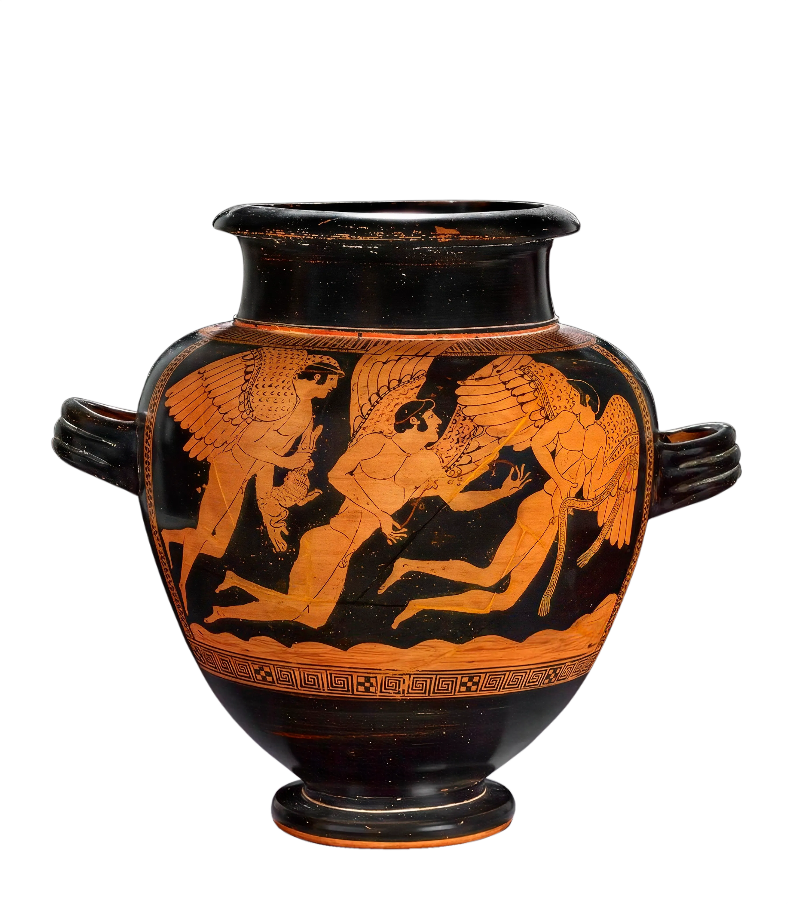

# Ithaca benchmark (v.1.0.0)

  

The Ithaca benchmark is the first-ever composite benchmark on humanities tasks and data. 

## How to use the benchmark

This repo contains evaluation data for humanities tasks and data from `Ithaca v.1.0.0`. There are 3 folders: machine translation, memorization, and retrieval. 

## Contribute to the benchmark

This is a live benchmark. Version 1.0.0 was released 2026, but subsequent versions will be released with new iterations. Contribute to our benchmark by joining our community! Email: `unsojo@cornell.edu`. 

